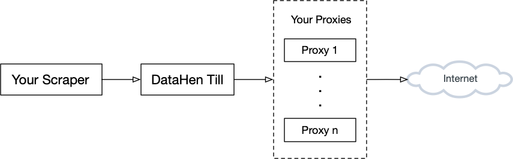
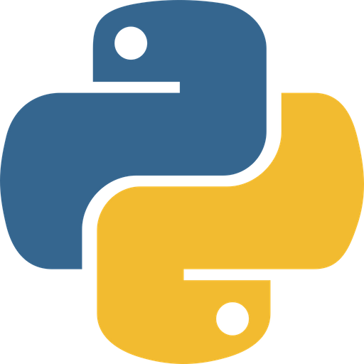
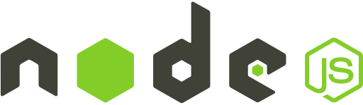
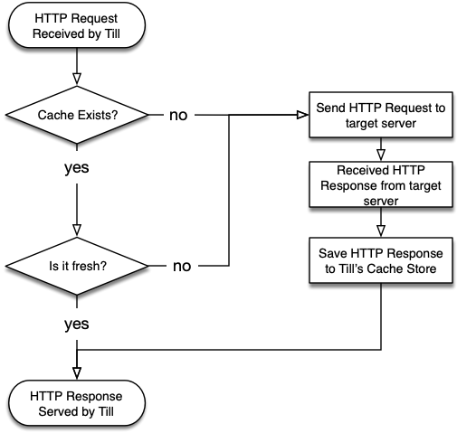
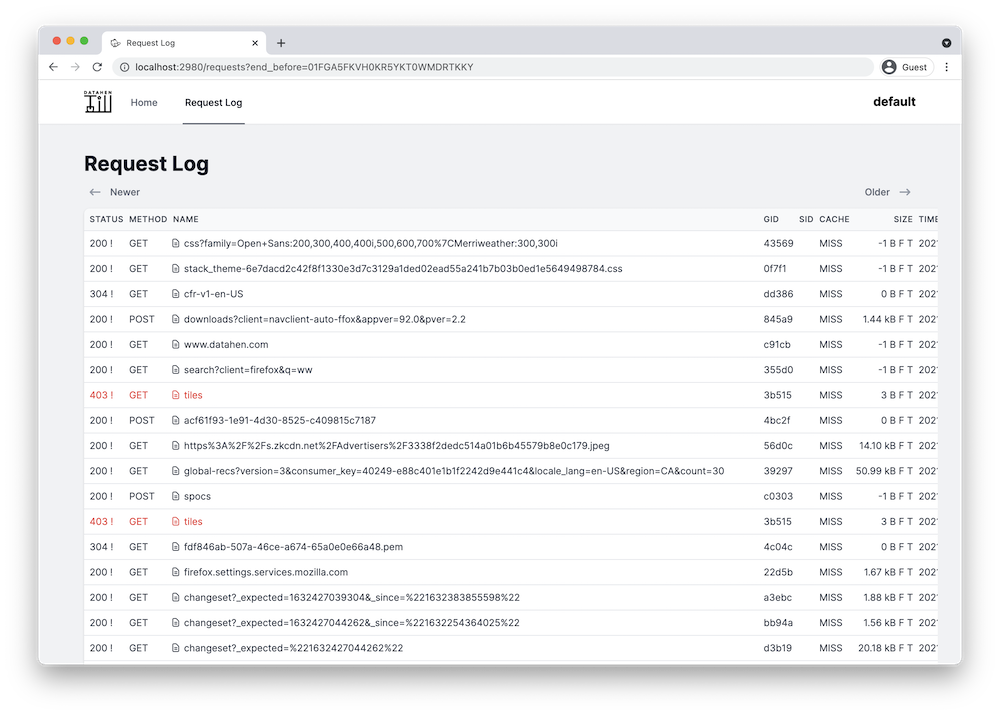

 **DataHen Till** is a companion tool to your existing web scraper that instantly makes it scalable, maintainable, and more unblockable, with minimal code changes on your scraper. Integrates with any scraper in 5 minutes.


Till was architected to follow best practices that [DataHen](https://www.datahen.com) has accumulated over the years of scraping at a massive scale.



### Till easily integrates with your existing scrapers...
written in languages such as:






or frameworks such as:


<br clear="left"/>


and many more...


# Table of Contents

* [Problems with Web Scraping](#problems-with-web-scraping)
    * [Scaling Your Scraper](#scaling-your-scraper)
    * [Blocked scraper](#blocked-scraper)
    * [Scraper Maintenance](#scraper-maintenance)
    * [Postmortem analysis & reproducability](#postmortem-analysis--reproducability)
    * [Starting over from scratch when it fails mid-way](#starting-over-from-scratch-when-it-fails-mid-way)
* [Features](#features)
    * [User-Agent randomizer](#user-agent-randomizer)
    * [Proxy IP address rotation](#proxy-ip-address-rotation)
    * [Sticky Sessions](#sticky-sessions)
    * [Managing Cookies](#managing-cookies)
    * [Request Logging](#request-logging)
    * [HTTP Caching](#http-caching)
    * [Global ID (GID)](#global-id-gid)
    * [Request Interceptions](#request-interceptions)
* [How DataHen Till works](#how-datahen-till-works)
* [Installation](#installation)
* [Certificate Authority (CA) Certificates](#certificate-authority-ca-certificates)
* [Till Integrations](#till-integrations)
    * [Python](#python)
        * Scrapy
    * [Node.js](#nodejs)
        * Plain
        * Puppeteer
    * [Go](#go)
        * net/http
        * Colly
    * [Ruby](#ruby)
        * Kimurai

# Problems with Web Scraping


Web scraping is usually easy to get started, especially on a small scale. However, as you try to scale it up, it gets exponentially difficult. Scraping 10,000 records can easily be done with simple web scraper scripts in any programming language, but as you try to scrape millions of pages, you would need to architect and build features on your web scraping script that allows you to scale, maintain and unblock your scrapers. 


**DataHen Till** solves the following problems:


## Scaling your scraper
Scraping to millions or even billions of records requires much more pre-planning. It's not simply running your existing web scraper script in a bigger CPU/Ram machine. 
More thoughts are needed, such as: 

- How to log massive amounts of HTTP requests. 
- How to troubleshoot HTTP requests, when it fails at scale.
- How to minimize bandwidth usage. 
- How to rotate proxy IPs.
- How to handle anti-scrapers.
- What happens when a scraper fails.
- How to resume scrapers after they are fixed.
- etc.


Till provides a plug-and-play method of making your web scrapers scalable, and maintainable following best practices at [DataHen](https://www.datahen.com) that makes web scraping a pleasant experience. 

## Blocked scraper
As you try to scale up the number of requests, quite often, the target websites will detect your scraper and try to block your requests using Captcha, or throttling, or denying your request completely. 

Till helps you circumvent detected as a web scraper by identifying your scraper as a real web browser. It does this by generating random `user-agent` headers and randomizing proxy IPs (that you supply) on every HTTP request. 

Till also makes it easy for you to troubleshoot on why the target website block your scraper.

## Scraper Maintenance
Maintaining high-scale scrapers is challenging due to the massive volume of requests and interactions between your scrapers and the target websites. In order for a smooth operation, you need to think through how to maintain your scrapers regularly. 

You need to know how to raise and triage errors as they occur on your scrapers, not all errors on web scraping should be treated equally. some are ignorable, and some are urgent. So, you will need to know what will be the details of your "development-deployment-maintenance" process will be.

Till solves this by logging all your HTTP requests and categorizing them whether it was successful (2XX statuses) or failures(non 2XX statuses). Till also provides a Web UI to analyze the request history and make sense of what happened during your scraping process.

Till makes it even easier for scraper maintenance by assigning each request with a unique Global ID (GID) that is derived from the request's URL, method, body, etc. You can then use this GID to troubleshoot your scrapers on where it went wrong.

## Postmortem analysis & reproducability
The biggest difficulty facing any web scraper developer is when there are scraping failures. Your scraper fails when fetching or parsing certain URLs, but when you look at the target website and URLs, everything looks fine. How do you troubleshoot what already happened in the scenario?. How do you reproduce that failed scrape so that you can fix the issue?

Till stores all HTTP requests and the responses (including the response body/content) into a local cache. If at anytime your scraper encounters an error, you can then use the request's GID (Till assigns a Global ID, also called GID, on every request) to find the request and the actual response and content from the cache. In this way, you can analyze what went wrong with that particular request.

## Starting over from scratch when it fails mid-way
Websites change all the time and without notice. Imagine running your web scraper for a week and then suddenly, somewhere along the way, it fails. It is frustrating that once you've fixed the scraper, there is a high chance that you'd need to start over from scratch again. And, on top of this, there are additional consequences, such as time delay, and further charges related to proxy usage, bandwidth, storage, VM costs, etc. 

Till solves this by allowing you to replay your scrapers without actually needing to resend the HTTP requests to the target server.
Till does this by assigning each HTTP request its own unique Global ID (GID) that is generated from the request's URL, method, headers, etc. It then stores all HTTP responses in the Cache based on their GID.

When you restart your scraper, the scraping process can go blazingly fast because Till now serves the cached version of the HTTP responses. All of this without any code changes on your existing web scraper.

# Features


## [User-Agent randomizer](https://till.datahen.com/docs/user-agent-randomizer)
Till automatically generates random user-agent on every request. Choose to identify your scraper as a desktop browser, or a mobile browser, or you can even override it with your custom user-agent.

## [Proxy IP address rotation](https://till.datahen.com/docs/proxy-ip-address-rotation)
Supply a list of proxy IPs, and Till will randomly use them on every request. Saves you time in needing to set up a separate proxy rotation service.

## [Sticky Sessions](https://till.datahen.com/docs/sticky-sessions)
Your scraper can selectively reuse the same user-agent, proxy IP, and cookie jar for multiple requests. This allows you to easily group your requests based on certain workflow, and allow you to avoid detection from anti-scraping systems. 

## [Managing Cookies](https://till.datahen.com/docs/sticky-sessions#manage-cookies)
No need to build your cookie management logic in your scraper codes. Till can store the cookies for you so that you can easily reuse them on subsequent requests.


## [Request Logging](https://till.datahen.com/docs/request-log)
Till will log your requests based on successful request (2XX status code) or failed request (non 2XX status code). This will allow you to easily troubleshoot your scraper later. 

The Till UI allows you to make sense of HTTP request history, and troubleshoot what happens during a scraping session.


## [HTTP Caching](https://till.datahen.com/docs/http-caching)
Till caches all of your HTTP responses (and their contents), so that as needed, your web scraper will reuse the cache without needing to do another HTTP request to the target server. 

You can selectively choose whether to use a particular cached content or not by specifying how fresh you want Till to serve the cache. For example: If Till holds an existing cached content that is 1 week old, but your web scraper only wants 1-day old content, Till will then only serve cached contents that are 1 day old.



## [Global ID (GID)](https://till.datahen.com/docs/http-caching#gid)
Till uses [DataHen Platform](https://www.datahen.com/platform)'s convention of marking every unique request with a signature (we call this the Global ID or GID for short). Think of it like a Checksum of the actual request. 

Anytime your scraper sends a request through Till, it will return a response with the header `X-DH-GID` that contains the GID. This GID allows you to easily troubleshoot requests when you need to look up specific requests in the log, or contents in the cache.

## [Request Interceptions](https://till.datahen.com/docs/request-interception)
Till can intercept any HTTP request of your choice, and replace with any HTTP response. 

The following are some examples of useful scenarios:

- Ignoring Google Analytics javascript
- Ignoring images or other files
- Replacing (stubbing) an API call with a different response
- Restricting your scraper to only certain URL patterns.


# How DataHen Till works

Till works as a Man In The Middle (MITM) proxy that listens to incoming HTTP(S) requests and forwards those requests to the target server as needed. While it does so, it enhances each request to avoid being detected by anti-scrapers. It also logs and caches the responses to make your scraper maintainable and scalable.

Connect your scraper to Till via the `proxy` protocol that is typically common in any programming language.

Your scraper will then continue to run as-is and it will get instantly become more unblockable, scalable, and maintainable.


# Installation

## Step 1: Download Till

The recommended way to install DataHen Till is by downloading one of the [standalone binaries](https://github.com/DataHenHQ/till/releases) according to your OS.


## Step 2: Get your auth Token

You need to get your auth token to run Till.

Get your token for FREE by signing up for an account at [till.datahen.com](https://till.datahen.com).


## Step 3: Start Till

start the Till server with the following command:
```bash
$ till serve -t <your token here> 
```
The above will start a proxy port on [http://localhost:2933](http://localhost:2933)
and the Till UI on [http://localhost:2980](http://localhost:2980).



## Step 4 Connect to Till

You can connect your scraper to Till without many code changes. 

If you want to connect to Till using curl, this is how:


```bash
$ curl -k --proxy http://localhost:2933 https://fetchtest.datahen.com/echo/request
```


# Certificate Authority (CA) Certificates
Till decrypts and encrypts HTTPS traffic on the fly between your scraper and the target websites.  In order to do so, your scraper (or browser) must be able to trust the built-in Certificate Authority (CA). This means the CA certificate that Till generates for you, needs to be installed on the computer where the scraper is running.

**Note:** If you do not wish to install the CA certificate, you can still have your scraper connect to the Till server by disabling/ignoring security checks in your scraper. Please refer to the programming language/framework/tool that your scraper uses.

## Installing the generated CA certificates onto your computer
The first time Till runs as a server, Till generates the CA certificates in the following directory: 

Linux or MacOS:
```
~/.config/datahen/till/
```

Windows:
```
C:\Users\<your user>\.config\datahen\till\
```
Then, please follow the following instructions to install the CA certificates:
### MacOS

[Add certificates to a keychain using Keychain Access on Mac](https://support.apple.com/en-ca/guide/keychain-access/kyca2431/mac)

### Ubuntu/Debian
[How do I install a root certificate](https://askubuntu.com/questions/73287/how-do-i-install-a-root-certificate/94861#94861)

### Mozilla Firefox
[how to import the Mozilla Root Certificate into your Firefox web browser](https://wiki.mozilla.org/MozillaRootCertificate#Mozilla_Firefox)

### Chrome
[Getting Chrome to accept self-signed localhost certificate](https://stackoverflow.com/questions/7580508/getting-chrome-to-accept-self-signed-localhost-certificate/15076602#15076602)

### Windows
Use `certutil` with the following command:

```
certutil -addstore root <path to your CA cert file>
```

Read more about [certutil](https://web.archive.org/web/20160612045445/http://windows.microsoft.com/en-ca/windows/import-export-certificates-private-keys#1TC=windows-7)


# Till Integrations

## Python

### Scrapy
The [Scrapy example](examples/python/scrapy/) demonstrates how to integrate Till with Python's [Scrapy framework](https://github.com/scrapy/scrapy).


## Node.js

### Plain
The [Node.js example](examples/nodejs/plain/) demonstrates how to integrate Till with Node.js based scrapers.

### Puppeteer
The [Puppeteer example](examples/nodejs/puppeteer/) demonstrates how to integrate Till with Puppeteer.

## Go

### net/http
The [Go net/http example](examples/go/standard) demonstrates how to integrate Till with Go's net/http standard library.

### Colly
The [Go Colly example](examples/go/colly) demonstrates how to integrate Till with [Colly](https://github.com/gocolly/colly).

## Ruby

### Kimurai
The [Ruby's Kimurai framework example](examples/ruby/kimurai) demonstrates how to integrate Till with Ruby's [Kimurai framework](https://github.com/vifreefly/kimuraframework).
